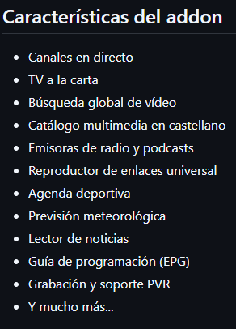

# EspaTV — Repositorio para Kodi

Addon todo en uno para contenido en castellano: TDT, RTVE a la carta, YouTube, Dailymotion, radio, podcasts, top películas y series, filmoteca, prensa, música, documentales, audiolibros, noticias, meteorología, agenda deportiva, mercados, precio de la luz, gasolineras, tráfico (DGT) y mucho más.

## Fuente e instrucciones de instalación

[https://espakodi.github.io/espatv/](https://espakodi.github.io/espatv/)

## Instalación paso a paso

### Opción 1 — Desde repositorio (recomendado, recibe actualizaciones automáticas)

1. En Kodi ve a **Ajustes** → **Administrador de archivos** → **Añadir fuente**
2. Introduce esta URL exacta: `https://espakodi.github.io/espatv/`
3. Asígnale un nombre, por ejemplo `espatv`, y pulsa OK
4. Ve a **Add-ons** → icono de paquete (esquina superior izquierda) → **Instalar desde archivo ZIP**
   > Si aparece el aviso de seguridad: **Ajustes** → **Sistema** → **Add-ons** → activar **Orígenes desconocidos**
5. Selecciona la fuente `espatv` → `repository.espatv-1.0.0.zip`
6. Cuando aparezca la notificación "Add-on instalado", ve a **Instalar desde repositorio** → **EspaTV Repository** → **Add-ons de vídeo** → **EspaTV** → **Instalar**

### Opción 2 — Desde ZIP (sin actualizaciones automáticas)

1. Descarga el `.zip` desde [github.com/fullstackcurso/espatv/releases](https://github.com/fullstackcurso/espatv/releases)
2. En Kodi ve a **Add-ons** → icono de paquete → **Instalar desde archivo ZIP** → selecciona el archivo

## Verificación de integridad — v2.0.0

```
MD5:    592e69d91748d18506c6b141fa2aa985
SHA256: 82128a584d0f8d10fdd127405f3af8322ae58b9d402389075374b696c71b43de
```

<p align="left">
  
</p>

## Contacto

- Telegram: [t.me/rubensdfa1laberot/?direct](https://t.me/rubensdfa1laberot/?direct)

&nbsp;
> [!NOTE]
> **Legalidad:**
> EspaTV no aloja contenido ni elude protecciones de derechos de autor. Es un agregador que enlaza a fuentes públicas y gratuitas disponibles en internet.


